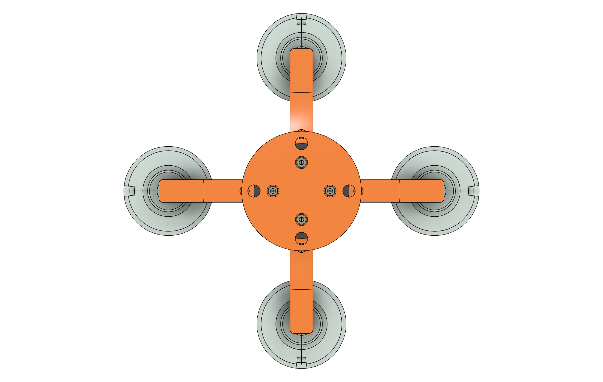
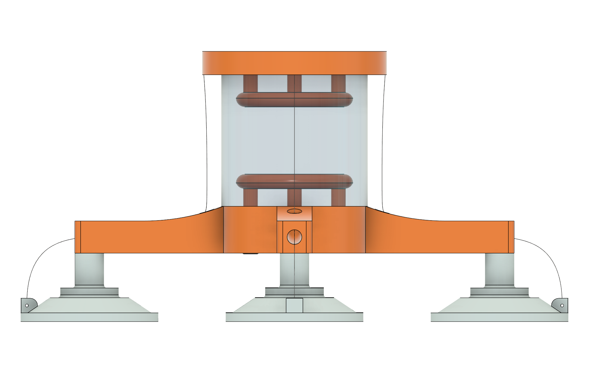
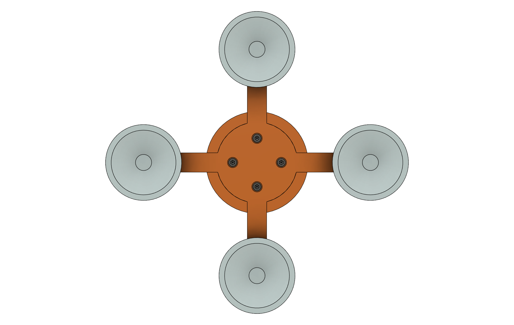

# Passive Soft Base Attaching Gripper

This repository contains the design models and figures for the passive soft base attaching gripper, as presented in the IEEE scientific article [Article Title, Year].

## Overview

The passive soft base attaching gripper is designed for [brief description of the gripper's purpose, e.g., robotic manipulation in unstructured environments]. This repository provides all necessary models to replicate the design, ensuring reproducibility and accessibility.

## Visual Overview

Here are key views of the gripper assembly:

<table>
  <tr>
    <th align="center">Top View</th>
    <th align="center">Side View</th>
    <th align="center">Bottom View</th>
  </tr>
  <tr>
    <td align="center"></td>
    <td align="center"></td>
    <td align="center"></td>
  </tr>
</table>

Additional views: [Exploded View](Figures/Exploded.png), [Assembly](Figures/Assembly.png), [Top View without UR10 Mount](Figures/Top view without UR10 mount.png).

## Repository Structure

- **📂 Models**: Contains the 3D models for the gripper components.
  - **🔧 Fusion**: Autodesk Fusion 360 files (.f3d, .f3z) for parametric design.
  - **🖨️ STL**: Stereolithography files (.stl) for 3D printing or visualization, accessible without Fusion 360.
- **🖼️ Figures**: Important figures from the article, including diagrams, schematics, and experimental results.

## Usage

### For Researchers and Engineers
- Download the Fusion files to modify or adapt the design.
- Use the STL files for 3D printing prototypes or simulation inputs.
- Refer to the figures for detailed explanations of the design and performance.

### Software Requirements
- Autodesk Fusion 360 (for .f3d/.f3z files)
- Any STL viewer or 3D printer software (for .stl files)

## Future Additions
- Measurement data and processing scripts (Python/MATLAB)
- Simulation models (e.g., in Gazebo or Simulink)

## Citation

If you use this work in your research, please cite:

[Insert IEEE citation here, e.g., Author(s). "Title of the Article." Journal Name, vol. XX, no. YY, pp. ZZ, Year.]

## License

This work is licensed under the [MIT License](LICENSE) / [CC BY 4.0](LICENSE) / [Specify appropriate license for scientific work].

## 📧 Contact

For questions or collaborations, contact Jakob Domislovic at jakob.domislovic@fer.unizg.hr.
